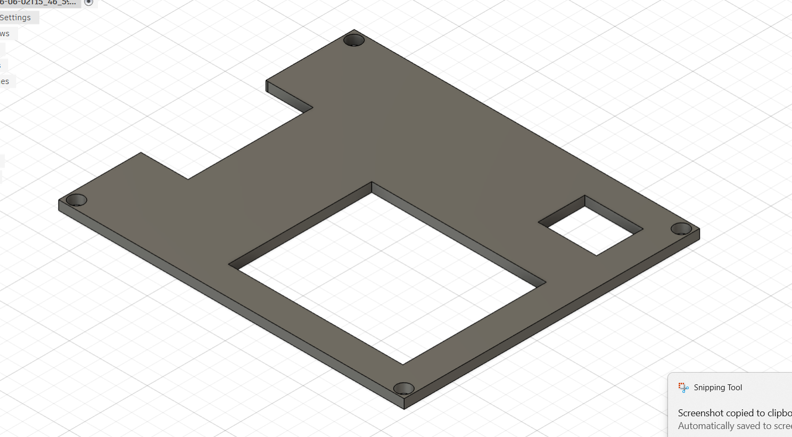
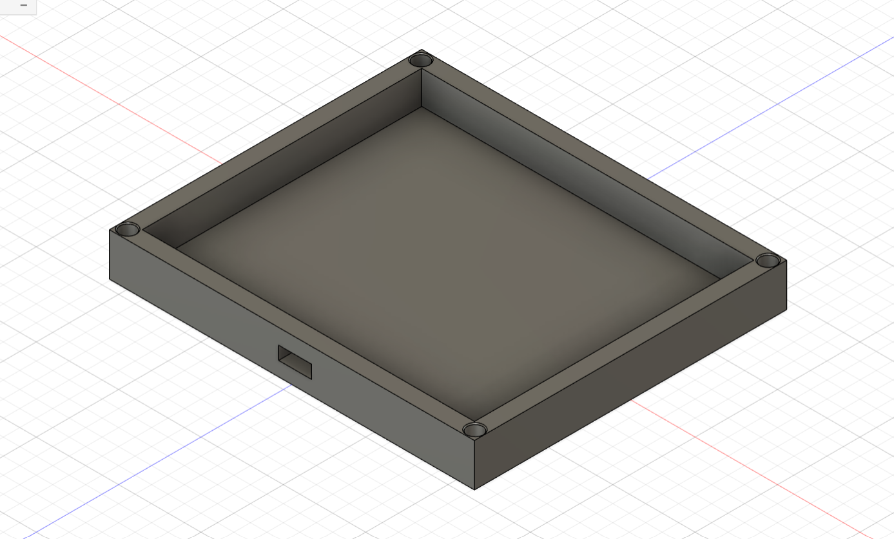

# Custom 6-Key Macropad with Rotary Encoder & OLED Display

A compact, DIY custom macropad built around the **Seeed Studio XIAO RP2040** microcontroller and running the open-source **KMK Firmware** (CircuitPython). This pad features 6 mechanical keyswitches, a 7-pixel chained SK6812 MINI-E RGB strip, a volume rotary encoder, and a sleek 0.91" SSD1306 128x32 OLED display running custom frame animations.

## 🧠 Why I Made This Project
I designed and constructed this custom 6-key macropad to bridge my interests in physical hardware engineering and digital automation. As someone diving deep into programming and data management, I wanted a physical desktop hub that could trigger specialized macro blocks on-the-fly, optimizing my coding speed while simultaneously teaching me the fundamentals of schematic routing, 3D mechanical enclosure assembly, and firmware layout.

## 🚀 Features
* **Dynamic JSON Configuration:** Keybinds are completely modular and loaded on-the-fly from a local `commands.json` file without modifying the main firmware.
* **Volume Rotary Encoder:** Clockwise/counterclockwise scroll tracking mapped to system volume adjustments.
* **Custom OLED Animations:** Bypasses default KMK layer readouts to loop custom 1-bit `.pbm` flipbook animations built for the compact 128x32 screen format.
* **RGB Breathing Effect:** Smooth breathing lighting profile across a 7-pixel SK6812 MINI-E LED chain.

---

## 🎨 Hardware Design, Schematics & Enclosure

### 📐 Schematic Diagrams
The circuit schematic handles direct GPIO switch tracking to keep the design highly responsive and simple, utilizing internal pull-up resistors on the RP2040.


### ⚡ Printed Circuit Board (PCB) Layout
The 2D PCB layout artwork is optimized for the tight form factor of the Seeed Studio XIAO footprint. Tracks are routed cleanly with thick power lines to safely drive the addressable RGB rail.


### 📦 Enclosure & Case Assembly
The enclosure is a low-profile design featuring heatset inserts for durable fastening. 

| Top Case Housing | Bottom Case Plate |
| :---: | :---: |
|  |  |

* **Layer Height:** 0.2mm
* **Infill:** 15% - 20% Gyroid (provides a solid weight distribution)
* **Hardware Requirements:** Requires 6x M3 heatset inserts melted into the top case housing, secured using 6x M3x16mm screws from the base plate.

---

## 📋 Bill of Materials (BOM)

The following matrix details the exact hardware required for assembly vs. the total material inventory available. You can also download the complete [BOM.csv](./BOM.csv) dataset directly from this repository.

| Item | Required Qty | Inventory Qty | Component Description | Sourcing / Part Notes |
| :---: | :---: | :---: | :--- | :--- |
| 1 | 1 | 1 | **Seeed Studio XIAO RP2040** | Main Microcontroller Board (Unsoldered) |
| 2 | 1 | 1 | **0.91" SSD1306 OLED Display** | 128x32 Pixel Screen, I2C Interface (**Pin order: GND-VCC-SCL-SDA**) |
| 3 | 1 | 2 | **EC11 Rotary Encoder** | 20mm D-Shaft Encoder |
| 4 | 6 | 16 | **MX-Style Mechanical Switches** | Keyswitches of choice |
| 5 | 6 | 16 | **Blank DSA Keycaps** | White full keycap set pack |
| 6 | 7 | 20 | **SK6812 MINI-E RGB LEDs** | Reverse-mount addressable LEDs |
| 7 | 6 | 6 | **M3×16mm Screws** | Enclosure fasteners |
| 8 | 6 | 6 | **M3×5×4mm Heatset Inserts** | Brass threaded chassis inserts |
| 9 | 0 | 20 | **1N4148 Diodes** | Through-hole matrix diodes (Unused in direct pin layout) |
| 10 | 1 | 1 | **Soldering Iron Station** | Required for assembly (Target temperature: 320°C - 350°C) |
| 11 | 1 | 1 | **Rosin Core Solder Wire** | 60/40 or Lead-Free electrical solder for making connections |
---

## 🛠️ Hardware Pinout Layout

The firmware maps directly to the following physical tracks on the Seeed Studio XIAO RP2040:

| Component | Pin / Track Assignment | Function |
| :--- | :--- | :--- |
| **SW1 (pos_1)** | `D9` | Mechanical Switch 1 |
| **SW2 (pos_2)** | `D8` | Mechanical Switch 2 |
| **SW3 (pos_3)** | `D3` | Mechanical Switch 3 |
| **SW4 (pos_4)** | `D10` | Mechanical Switch 4 |
| **SW5 (pos_5)** | `D0` | Mechanical Switch 5 |
| **SW6 (pos_6)** | `D2` | Mechanical Switch 6 |
| **NeoPixel Strip**| `D1` | 7-Pixel LED Data Line |
| **OLED SCL** | `D5` | I2C Clock Line |
| **OLED SDA** | `D4` | I2C Data Line |
| **Encoder Pad A**| `D6` | Quadrature Signal A |
| **Encoder Pad B**| `D7` | Quadrature Signal B |
| **Encoder Pad C**| `GND` | Common Ground Connection |

---

## 🤖 AI Usage Declaration
This project was developed using a collaborative approach between human engineering and artificial intelligence.

Concept & Exploration: AI was utilized as a learning accelerator to research and explore unfamiliar concepts, including schematic routing techniques, CircuitPython structures, and efficient data management with JSON.

Collaboration over Automation: While AI assisted in breaking down complex technical documentation and troubleshooting hardware configurations, all physical assembly, custom CAD design choices, and structural testing were executed entirely by the author.

---

## 📂 File Structure Explained

Your `CIRCUITPY` drive root should look like this:

```text
├── kmk/                  # KMK Firmware Library Folder
├── boot.py               # Hardware/USB-level configuration script
├── main.py               # Main Python firmware script (The core brain)
├── commands.json         # Dynamic keymap configuration profile
└── animation.pbm         # 128x32 compiled monochrome flipbook image strip
